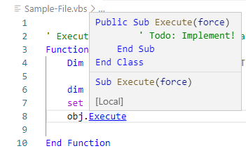
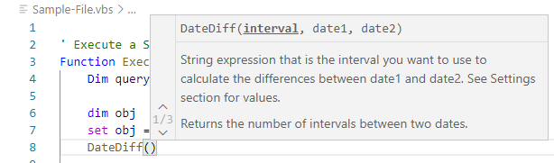

# VBScript Extension für Visual Studio Code
Diese Erweiterung bietet Sprachunterstützung für Visual Basic Script/VBScript/VBS für [Visual Studio Code](https://code.visualstudio.com/).

[](https://marketplace.visualstudio.com/items?itemName=serpen.vbsvscode)
[](https://ci.appveyor.com/project/Serpen/vbs-vscode)

<p align="center">
  <a href="./README.md">English</a> | 
  <span>Deutsch</span>
</p>

## Features
- Gliederung
- Autovervollständigung


- Gehe zu Definition
- Ausführen (kein Debugging)
- Hover


- Signaturen



- Farbinformationen anzeigen


- Zusätzliche VBS Funktions Bibliotheken als VBS Dateien einbinden
```
{ // settings.json
    "vbs.includes": ["c:\\mylibrary.vbs"]
}
```

## Mitarbeit
Du kannst dieses Projekt unterstützen, indem du die Quelldateien forkst und einen Pull Request/PR mit deinen Veränderungen erzeugst oder eine Issue mit deinem Problem/deiner Idee erzeugst.
- Vervollständigung der VBS Sprachdokumentation #21
- Übersetzung in weitere Sprachen
- ...


## Referenzen / Danksagung
Diese Erweiterung basiert auf der Visual Basic Erweitung die mit VS Code ausgeliefert wird und dem Design der AutoIt Erweiterung von loganch.

## Zweck
Die Erweiterung wurde entwickelt um die VBS Entwicklung innerhalb einer Geschäftssoftware (medico Klinische Dokumentation) zu unterstützen.
