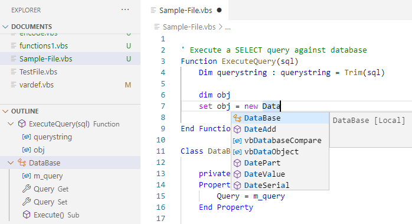

# VBScript Extension for Visual Studio Code
This extension implements basic language features of Visual Basic Script/VBScript/VBS for Visual Studio Code.

## Features
- Outline / Gliederung
- Completion / Autovervollständigung

- Goto Definition
- Run (no debugging)
- Hover

- Signatures

- Extend Completion with an extra VBS Language extending code file

## Configuration
| Config                 | Description                          
|------------------------|--------------------------------------|
|vbs.interpreter         | Path to Script Interpreter           |
|vbs.includes            | Array of additional VBS Source Files |
|vbs.showVariableSymbols | Show Variables in Outline            |

## References / Thanks
This project is based on the Visual Basic extension shipped with VS Code and the AutoIt Extension https://github.com/loganch/AutoIt-VSCode.

### Purpose
This project was founded to help developing with VBS in an buisness application (medico Klinische Dokumentation)